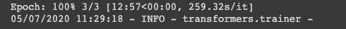
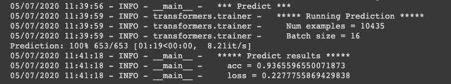
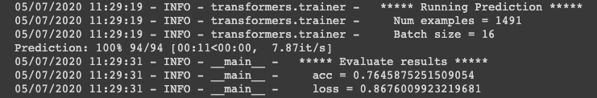
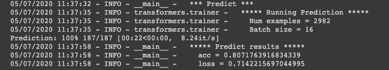

# rumors-ai-model

This model is based on [BERT](https://github.com/google-research/bert) and implemented on [Transformers](https://github.com/huggingface/transformers) maintained by [HuggingFace](https://huggingface.co/).

Documents of Transformers can be found [HERE](https://huggingface.co/transformers/index.html).

For the Quick Start guide, please check the [jupyter notebook demo](https://github.com/cofacts/rumors-ai/blob/master/ai_model/models/model_A/Multi_class_classification_for_Cofacts_article_using_BERT.ipynb).

If you prefer to run the model on Colab, we also provide the Colab link: https://colab.research.google.com/drive/1gAtSLQEwUdkFIs24Z8ARDfW664xIAmQh?usp=sharing


## Installation

This model is built on **Python 3.6+, PyTorch 1.0.0+ and TensorFlow 2.0**.

For the record, please follow the latest version description on Transformers [installtion](https://github.com/huggingface/transformers#installation).


### With pip

```bash
pip install transformers
```

### From source

```bash
git clone https://github.com/huggingface/transformers
pip install ./transformers/
```

#### Notes

It should be noted that there might be some installation differences between using pip and from source.

If you find some latest features do not work, you can try installing from source since it should be much newer. But the stable version is surely installing from pip.


## Preprocess the data format

In order to feed the data into BERT model, we need to transform the data format to what it can parse.

### Unzip the raw data

```bash
unzip -o ../../data/raw_data/raw_data.zip
```

You will get **14908** json files with labeled tags.


### Transfrom JSON files into CSV files

```bash
python ../../preprocess/transform_json_to_csv.py \
--data_dir ../../data/raw_data/ \
--output_dir ../../data/processed_data/
```

You will get **3** csv files in output_dir: **train/dev/test.csv**

The default dataset split ratio is **0.7/0.1/0.2**.

If you want to a different split ratio, please modify [transform_json_to_csv.py](https://github.com/cofacts/rumors-ai/blob/master/ai_model/preprocess/transform_json_to_csv.py) directly.


## Runing the model

You can directly run the model training or prediction using [run_multi_label_classification.py](https://github.com/cofacts/rumors-ai/blob/master/ai_model/models/model_A/run_multi_label_classification.py) with different arguments.

This multi label classification model are **customized for Cofacts dataset**, if you want to use it on your own data, you need to modify both python files.


### Training

```bash
python ./run_multi_label_classification.py \
--task_name cofacts \
--model_name_or_path bert-base-chinese \
--do_train \
--do_eval \
--data_dir ../../data/processed_data/ \
--learning_rate 1e-4 \
--num_train_epochs 3 \
--max_seq_length 128 \
--output_dir models_bert/ \
--per_gpu_eval_batch_size=16 \
--per_gpu_train_batch_size=16 \
--gradient_accumulation_steps 2 \
--overwrite_output
```

This is the fine-tuned training task start from Google's default pretrained [bert-base-chinese model](https://github.com/google-research/bert/blob/master/multilingual.md).

The training time takes around **20 mins** on **single T4 GPU** machine (Colab default).



Training with the **defined hyper-parameters** yields the following results:

```
Accuracy: 0.937
```



Developing dataset results:

```
Accuracy: 0.765
```




### Prediction

```bash
python ./run_multi_label_classification.py \
--task_name cofacts \
--model_name_or_path models_bert \
--do_eval \
--data_dir ../../data/processed_data/ \
--predict_file test.csv \
--per_gpu_eval_batch_size=16 \
--output_dir ./prediction/
```

Testing dataset results:

```
Accuracy: 0.807
```


