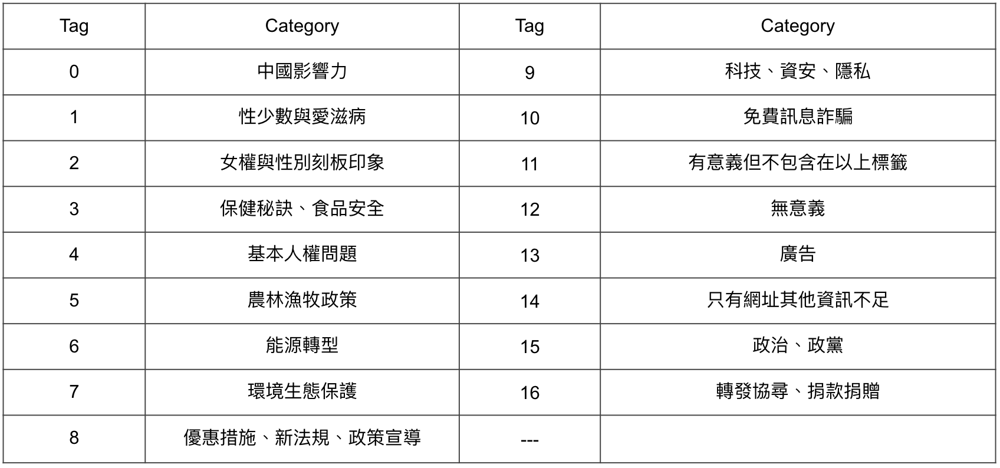
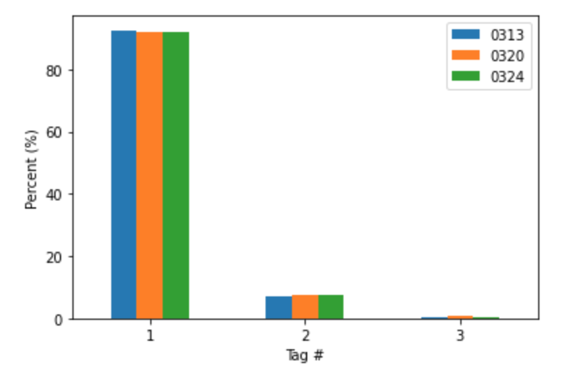
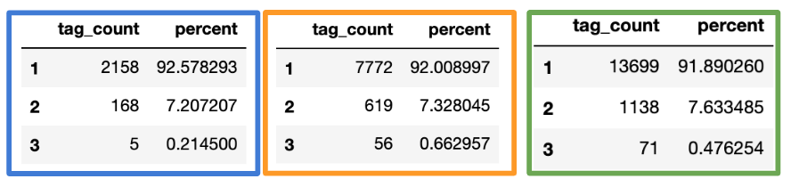
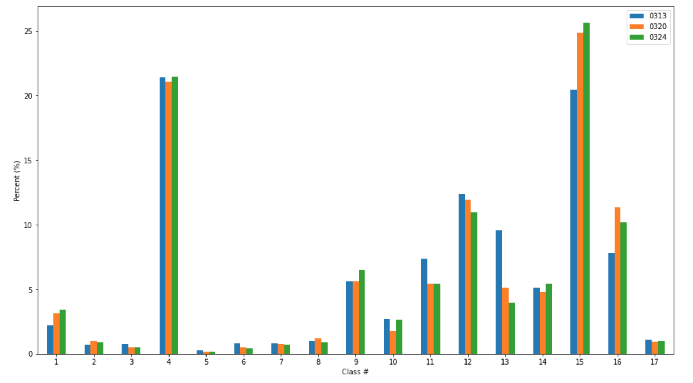
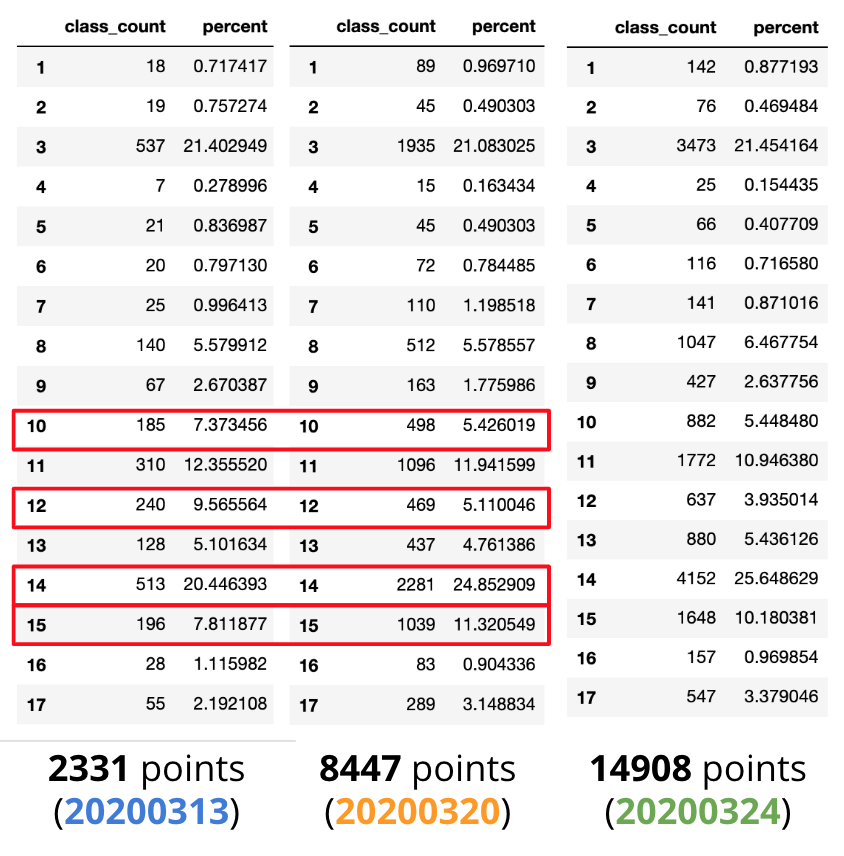

# Flow labeled dataset exploration

There are 3 time-consecutive labeled data provided by Flow:
1. 2020.03.13
2. 2020.03.20
3. 2020.03.24

Total labeled articles are 14,908.

This notebook is for data exploration and provided some insights of these labeled data.

## Cofacts pre-defined article classes

There are 17 classes listed below:

## Tag numbers distribution comparison

It should be noted that for each article may contain **more than 1 tag!**

From above figure and table, we can know that:
* There are at most 3 tags in one article
* Most articles are labeled with 1 tag (~92%)
* Tag numbers distributions are similar among all datasets

## Class number distribution comparison

From above figure, we can know that:
* Class 10, 12, 14, and 15 change dramatically between 0313 → 0320

To analyze in more detail, we plot the comparison table:

 

From above table, we can know that:
* [10 免費訊息詐騙]: 7.37% → 5.43%
* [12 無意義]: 9.57% → 5.11%
* [14 只有網址其他資訊不足]: 20.45% → 24.85%
* [15 政治、政黨]: 7.81% → 11.32%
* Pretty unbalanced labels
* Dominating Classes: [3] + [11] + [14] + [15]
  * 62.02% → 69.18% → 68.23% (from 0313 to 0324)

## Labeled data quality check and verification

In order to verify Flow labels quality, we are doing eyeball check on 3,000 randomly selected articles.

For the verification report, you can check it out at: **TBC**
